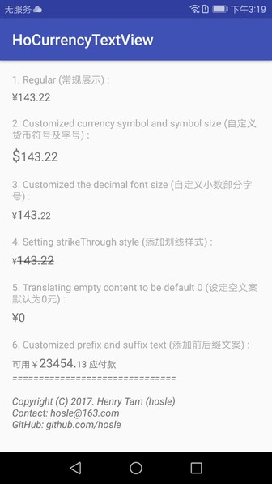

# HoCurrencyTextView

It's common to format numeric text to currency in E-commerce Apps. I am providing a customized textview that implement the formatting process in Android. Some useful APIs to customize its style are also provided.

# Features
* Adjust text string to currency format automatically. (Item 1 & item 2 in demo figure)
* Allow to add suffix or prefix text. (Item 6 in demo figure)
* Supporting strikethrough style. (Item 4 in demo figure)
* Supporting customize font size of each part, including currency symbol, integer, decimal and suffix/prefix. (Item 3 in demo figure)
* Translating empty content to be default 0. (Item 5 in demo figure)

# Demo



# Installation

Gradle

```java
dependencies {
	compile 'com.hosle.libcurrencyview:libcurrencyview:1.0.2'
}
```

Maven

```java
<dependency>
  <groupId>com.hosle.libcurrencyview</groupId>
  <artifactId>libcurrencyview</artifactId>
  <version>1.0.2</version>
  <type>pom</type>
</dependency>

```

# Usage

## XML
```java
<com.hosle.libcurrencyview.CurrencyTextView
        android:id="@+id/textview1"
        android:layout_width="wrap_content"
        android:layout_height="wrap_content"
        android:layout_marginTop="@dimen/currency_margin_top"
        android:text="23454.132"
        android:textSize="16dp"
        app:currencySymbol="$"
        app:currencySymbolSize="12dp"
        app:decimalTextSize="12dp"
        app:nullToZero="true"
        app:strikeThrough="true"
        app:prefixSuffixTextSize="12dp" />
```
## In Code

```java
textView.setSymbol(Currency.getInstance(Locale.getDefault()).getSymbol());
//default is ¥
textView.setText("143.22","可用"," 应付款");

textView.setText("143.22");
textView.setPrefixText("可用 ");
textView.setSuffixText(" 应付款");
```
# Lisence

```
Copyright (C) 2017. Henry Tam (Hosle) 

Contact: hosle@163.com

Licensed under the Apache License, Version 2.0 (the "License");
you may not use this file except in compliance with the License.
You may obtain a copy of the License at 

http://www.apache.org/licenses/LICENSE-2.0

Unless required by applicable law or agreed to in writing, software distributed under the License is distributed on an "AS IS" BASIS, WITHOUT WARRANTIES OR CONDITIONS OF ANY KIND, either express or implied.
See the License for the specific language governing permissions and limitations under the License.
```


